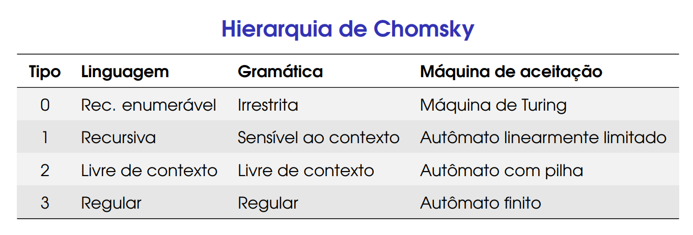

  
A hierarquia de Chomsky é uma classificação dos tipos de gramáticas formais, proposta pelo linguista Noam Chomsky em 1956. Essa hierarquia organiza as gramáticas de acordo com sua capacidade expressiva e poder computacional, dividindo-as em quatro níveis distintos, cada um representando um conjunto de linguagens reconhecidas por diferentes tipos de autômatos.

### Quem é Chomsky ?

Noam Chomsky (1927-presente): é um poeta, filósofo, linguista, professor do MIT, e crítico do capitalismo e da política externa americana

