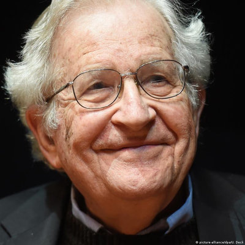

### Primeiramente quem é Chomsky ?

Avram Noam Chomsky (1927-presente): é um poeta, filósofo, linguista, professor do MIT, e crítico do capitalismo e da política externa americana

Chomsky também é um ativista e reconhecido com sua posição política nos Estados Unidos, e grande figura no ensino no âmbito da linguística.

Ele que gerou a grande hierarquia de Chomsky, que iremos abordar logo abaixo, é famoso por pesquisar vários tipos de linguagens formais procurando entender se poderiam ser capazes de capturar as propriedades-chave das línguas humanas.

### De fato a Hierarquia

Vamos utilizar a hierarquia de Chomsky como guia de nosso estudo de LFA,e chama-se hierarquia pois se o conhecimento de um, a próxima etapa será dificilmente entendível e compreensível, e para a hierarquia funciona da seguinte maneira:

#### 1º Etapa: Linguagens Regulares (LR):

- Gramatica Regular
- AF (autômato finito)
#### 2º Etapa: Linguagem Livre de Contexto (LLC):

- Gramatica Livre de contexto
- AFP (autômato com pilha)
#### 3º Etapa: Linguagem Recursiva (LRe):

- Gramatica Sensível ao Contexto
- Autômato linearmente limitado
#### 4º Etapa: Linguagem Recursivamente Enumerável (LRE):

- Gramática Irrestrita
- Máquina de Turing

