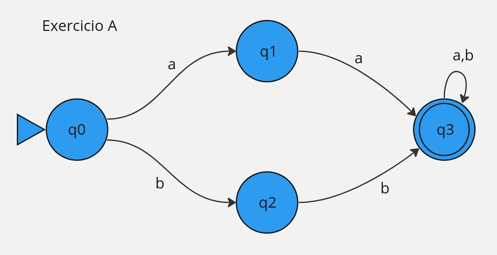
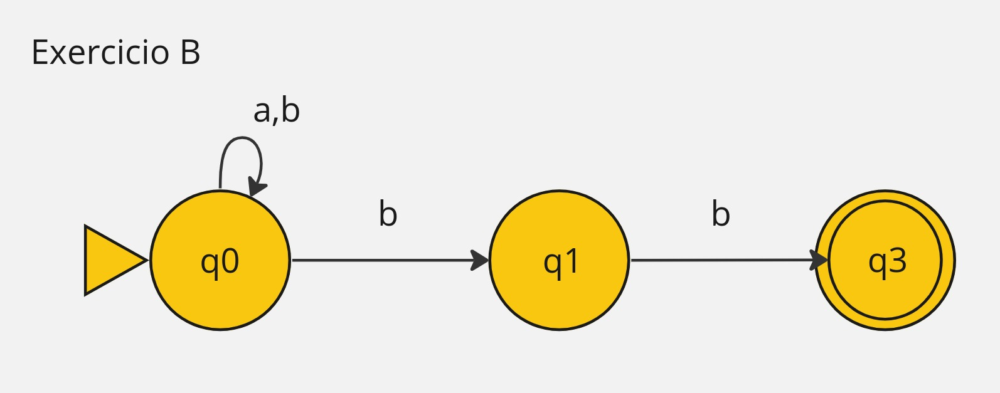
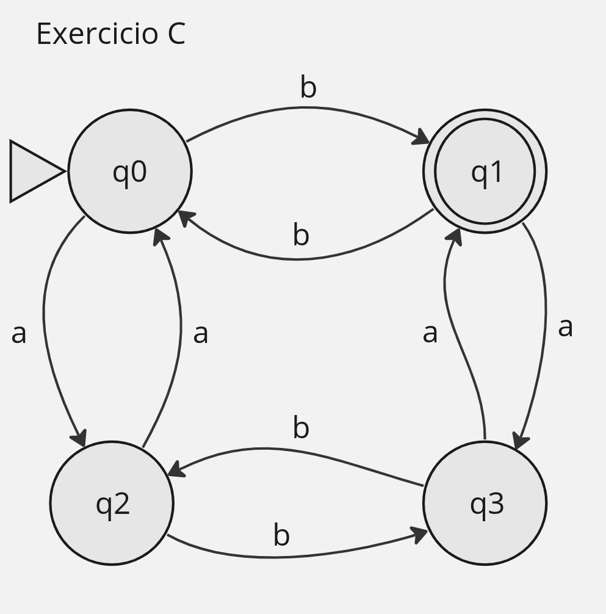

- 1. L = palavras sobre {a,b} que contém aa ou bb 

- 2. L = palavras sobre {a,b} que contém aaa 

- 3. L = palavras sobre {a,b} com número par de a e ímpar de b

Ir para: [2.4 Autômatos Indeterminísticos](07-automatos-inderministicos-afnd.md)