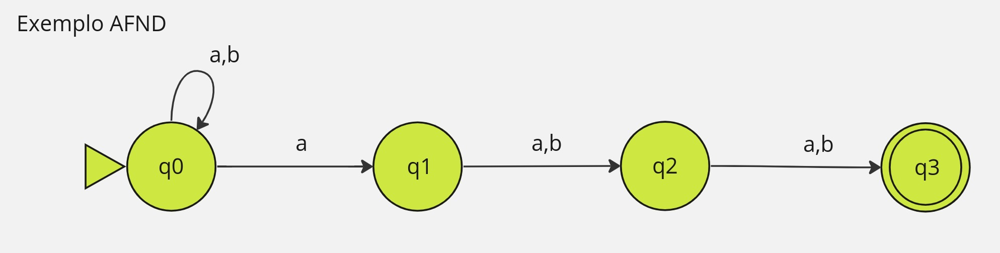
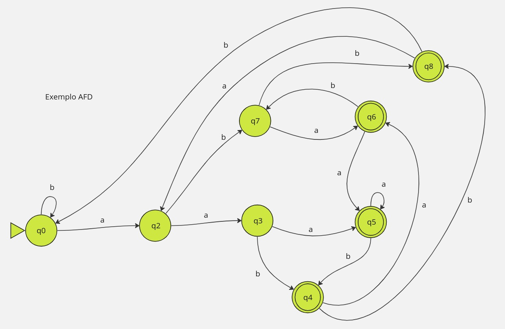

# Um exemplo de AFD e AFND

Uma linguagem que: O **TERCEIRO** Ultimo Simbolo é "a"

Temos então essa linguagem aceita é AFND abaixo
### AFND

Contudo... Se jogarmos na AFD, temos uma "pequena complicação", veja abaixo:
### AFD

Ir para: [2.8 Exercícios de AFND](08-exercicios-afnd.md)
Ir para: [2.10 Autômatos Indeterminísticos com Transição λ](10-automatos-inderministicos-λ-afnd-λ.md)