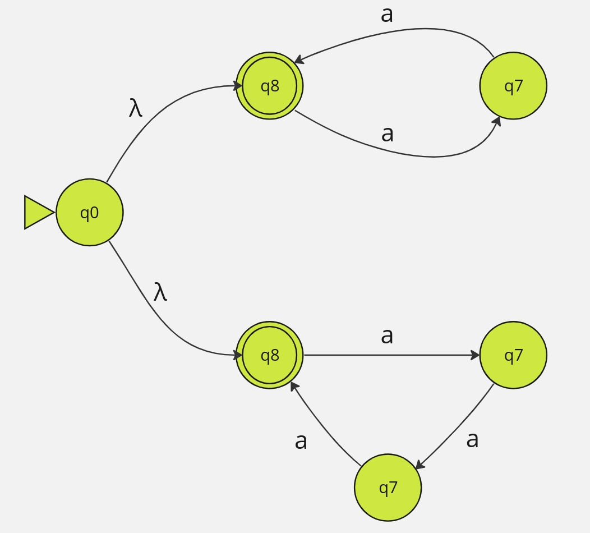

# Autômato Finito Não-Determinístico com Transições-λ

### Um AFND-λ é uma quíntupla (Q, Σ, δND−λ,q0, F): 

Q = conjunto finito de estados 
Σ = alfabeto 
δND−λ : Q x (Σ ∪ {λ}) → P(Q) = f. de transições de estados 
qo ∈ Q = estado inicial 
F ⊆ Q = conjunto de estados finais (aceitação)

Para todo AFND-λ, existe um AFND e um AFD equivalentes 
	i.e., não aumenta o poder computacional 
	
É muito similar ao AFND Tem como vantagem facilitar construções e demonstrações Por exemplo, o algoritmo ER → AFND-λ

L = {a k | k é múltiplo de 2 ou 3}

