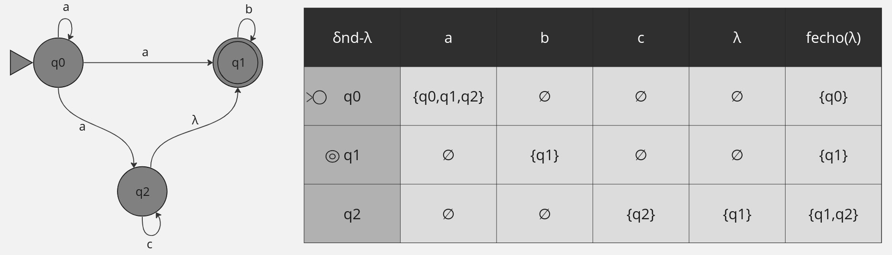
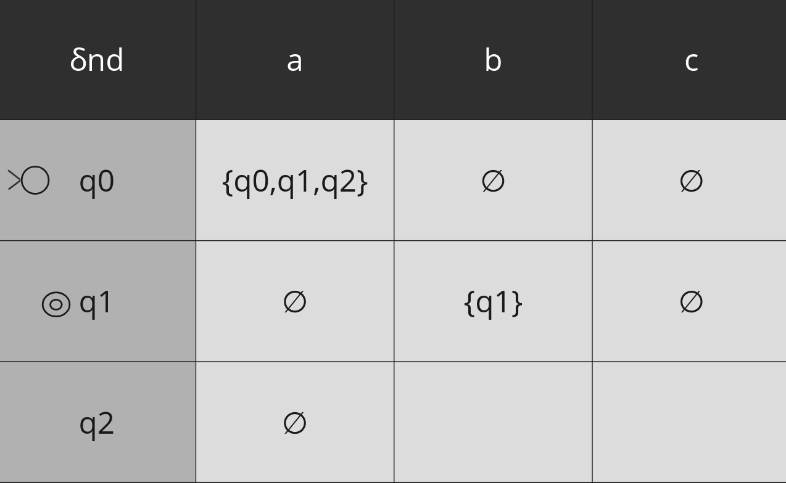
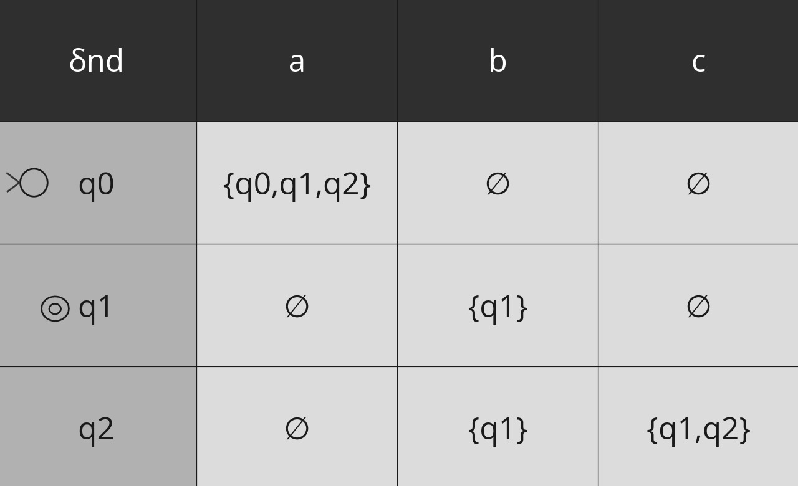

# WIP
# AFND-λ

#### fecho−λ(qi ) = qi + estados acessíveis a partir de qi lendo λ

## δND−λ → δND

São estados iniciais: fecho−λ(q0 )
- Todos os estados do fecho−λ(q0 ) são iniciais no AFND

Para os outros estados qi :
- considera todo estado em fecho−λ(qi )
- consome, para em um estado qj e então adiciona fecho−λ(qj)

### Passo 1:

(Explicar aqui)

### Passo 2

(Explicar aqui)