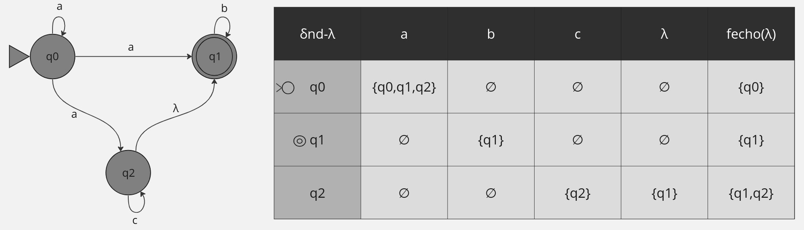
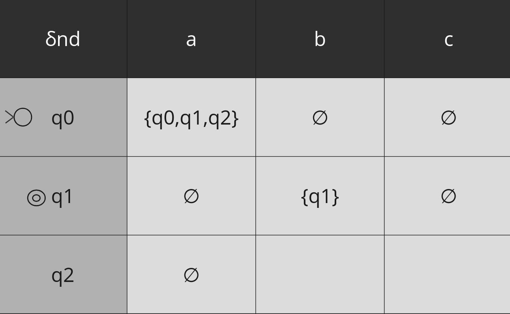
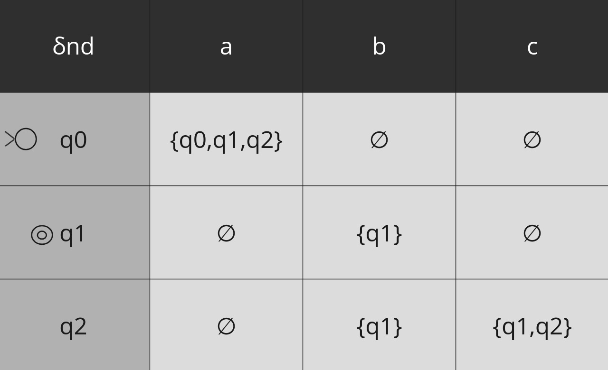

# Exemplo – Transformação AFND-λ → AFD

## AFND-λ de partida

AFND-λ com estados q0 (inicial), q1 (final) e q2, sobre Σ = {a, b, c}.

**Tabela δND-λ com fecho-λ:**

| δND-λ | a | b | c | λ | fecho(λ) |
|-------|---|---|---|---|---------|
| >∅ q0 | {q0, q1, q2} | ∅ | ∅ | ∅ | {q0} |
| ⊙ q1  | ∅ | {q1} | ∅ | ∅ | {q1} |
| q2    | ∅ | ∅ | {q2} | {q1} | {q1, q2} |

> fecho−λ(qi) = qi + estados acessíveis a partir de qi lendo apenas transições λ

---

## Passo 1: δND-λ → δND

Os estados iniciais do AFND são todos os estados de **fecho-λ(q0) = {q0}**.

Para cada estado qi, calculamos δND levando em conta o fecho-λ:
- A presença da transição λ de q2 → q1 (fecho-λ(q2) = {q1, q2}) muda as transições de q2:
  - **b:** a partir de fecho-λ(q2) = {q1, q2}, lendo b: δND-λ(q1,b) ∪ δND-λ(q2,b) = {q1} ∪ ∅ → fecho({q1}) = **{q1}**
  - **c:** a partir de fecho-λ(q2) = {q1, q2}, lendo c: ∅ ∪ {q2} → fecho({q2}) = **{q1, q2}**

**Tabela δND resultante:**

| δND | a | b | c |
|-----|---|---|---|
| >∅ q0 | {q0, q1, q2} | ∅ | ∅ |
| ⊙ q1  | ∅ | {q1} | ∅ |
| q2    | ∅ | {q1} | {q1, q2} |

---

## Passo 2: δND → AFD (Construção de Subconjuntos)

Estado inicial do AFD: **{q0}** (estados iniciais do AFND)

**Construção sob demanda (novos estados à medida que são necessários):**

| δD | a | b | c |
|----|---|---|---|
| >∅ {q0} | **{q0,q1,q2}** | ∅ | ∅ |
| ⊙ {q0,q1,q2} | {q0,q1,q2} | **{q1}** | **{q1,q2}** |
| ⊙ {q1} | ∅ | {q1} | ∅ |
| ⊙ {q1,q2} | ∅ | {q1} | {q1,q2} |

- {q0,q1,q2} é final pois contém q1
- {q1} e {q1,q2} são finais pois contém q1
- ∅ é o estado morto (sumidouro)

Ir para: [2.18 Autômatos com Saída – Máquina de Moore](18-automatos-com-saida-moore.md)