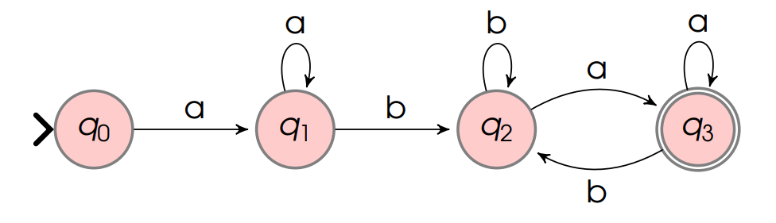

# Autômatos Finitos Determinísticos

### Um AFD é uma quíntupla (Q, Σ, δD,q0, F): 

Q = conjunto finito de estados;
Σ = alfabeto;
δD : Q x Σ → Q = função (total) de transições de estados;
q0 ∈ Q = estado inicial;
F ⊆ Q = conjunto de estados finais (aceitação);

### Conceito:

Uma palavra w ∈ Σ* é dita ser aceita por um AFD quando, partindo do estado inicial, forem lidos todos os símbolos de w e efetuadas as correspondentes transições de modo que, ao ler o último símbolo, o AFD para em um estado final.

A linguagem aceita por um AFD M (Q, Σ, δD,q0, F) é o conjunto:  L(M) = {w ∈ Σ * | δˆ D(q0, w) ∈ F}, onde δˆ D é a função de transição estendida para M.

## Exemplo:

L = palavras sobre {a,b} que começam e terminam com a e possuem pelo menos um b

Ir para: [2.5 Exercícios de AFD](5-exercicios-afd.md)
Ir para: [2.7 Autômatos Indeterminísticos](7-automatos-inderministicos-afnd.md)