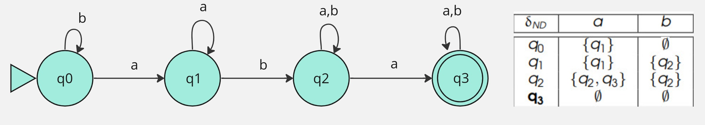

# Autômatos Finitos Indeterminísticos

### Um AFND é uma quíntupla (Q, Σ, δND,q0, F):

Q = conjunto finito de estados 
Σ = alfabeto 
δND : Q x Σ → P(Q) = função (total) de transições de estados 
qo ∈ Q = estado inicial 
F ⊆ Q = conjunto de estados finais (aceitação)

Uma palavra w ∈ Σ* é dita ser aceita por um AFND se, e somente se, existe uma computação que a consome e para em um estado final 

Para todo AFND, existe um AFD equivalente 
	i.e., não aumenta o poder computacional

Exemplo:

L = palavras sobre {a,b} que começam e terminam com a e possuem pelo menos um b

### Aceitação / Rejeição 

Um AFND aceita a entrada quando 
- após processar o último símbolo, em alguma das possíveis computações, assume um estado final (F) 

Um AFND rejeita a entrada quando 
- (1) após processar o último símbolo, em todas as possíveis computações, assume um estado não final 
- (2) trava durante seu processamento, em todas as possíveis computações 
- (3) qualquer combinação de (1) ou (2) 
	- e.g., das 10 possíveis computações, 7 assumem estado não final e 3 travam

### Pontos Importantes 

Muitas vezes, é muito mais fácil desenvolver um AFND do que um AFD 
- Por exemplo: 
- L = palavras sobre {a,b} cujo quinto último símbolo é a 
	- Solução AFD: trabalhosa, 32 estados Solução 
	- AFND: simples, 6 estados

### Um estratégia bem conhecida: 

Construir o AFND Aplicar o algoritmo AFND → AFD 

Ir para: [2.8 Exercícios de AFND](8-exercicios-afnd.md)