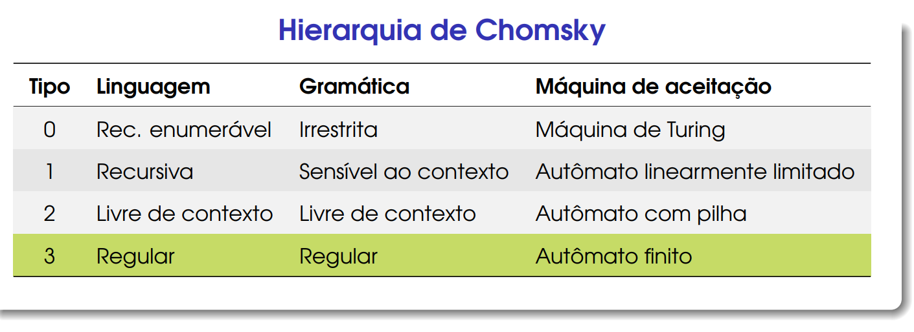

Na Hierarquia de Chomsky, começaremos na base de sua pirâmide, a *Linguagem Regular*

Vamos iniciar com as expressões regulares, regularmente chamado como RegEx
#### Exemplo 1:

Onde (Σ = {a, b}) **Todas palavras tem apenas a e b no alfabeto**

Uma linguagem que aceita palavras com pelo menos uma ocorrência de bb: 

- L = (a U b)* (bb) (a U b)*

Explicação: 
- **(a U b)** pode ser, "a" ou "b";
- O " * " é um loop aceitando nada
- O " + " é um loop que deve ter ao menos um cardinal

Com isso, podemos seguir e concluir que *todas essas são aceitas*:

	aaabbbaaaa
	aaabba
	bbaa

Contudo se não houver palavra sem bb no meio como:

	aaaaaabaaaa
	aaabaaa
	aaaaaaa

*Não são aceitas*, pois é **Obrigatório** ter ao menos dois b's
